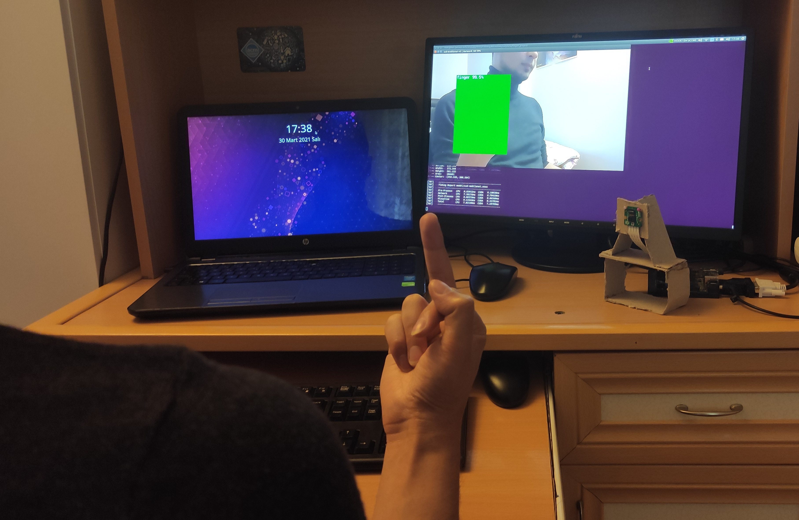

<div align="center">
  
</div>

# Real Time The Finger Detection with Nvidia Jetson 

## Motivation
In Western culture, [the finger](https://www.wikiwand.com/en/The_finger) or the middle finger is an obscene hand gesture. It is performed by showing the back of a hand that has only the middle finger extended upwards, though in some locales, the thumb is extended.

The contents on the internet becoming much more accessible though there is not enough access restrictions when it comes to the kids. Simply, kids do what they see. It is not cool for your child to show 'the finger' after watching PewDiePie where the majority of the audience is children.

<div align="center">
  
</div>
<br>

## Project
I have developed an object detection model that can detect the finger and censors it. The model can be found in <a href='model'>here</a>. This project uses:

<li>Nvidia Jetson Xavier Nx (any jetson would be fine)</li>
<li>Raspberry Pi Camera Module V2 (any camera that jetson supports would be fine)</li>
<li>jetson-inference library</li>
<li> One middle finger</li>

<br>

<div align="center">
  
</div><br>

> Me showing the finger to the camera can be found [here](https://www.youtube.com/watch?v=XT6rzC5_HAw).

[Jetson-inference](https://github.com/dusty-nv/jetson-inference) library is awesome! It provides guide and realtime [DNN Vision](https://github.com/dusty-nv/jetson-inference#api-reference) library for [Jetson Nano/TX1/TX2/Xavier NX/AGX Xavier](http://www.nvidia.com/object/embedded-systems.html). Also this project uses NVIDIA [TensorRT](https://developer.nvidia.com/tensorrt) for fast and efficient detection.


[jetson-inference](https://github.com/dusty-nv/jetson-inference) is a library of TensorRT-accelerated deep learning networks for image recognition, object detection with localization (i.e. bounding boxes), and semantic segmentation. This inferencing library (libjetson-inference) is intended to be run on the Jetson, and includes support for both C++ and Python. Various pre-trained DNN models are automatically downloaded to get you up and running quickly.

## Run


1. Build jetson-inference from the source with [this guide](https://github.com/dusty-nv/jetson-inference/blob/master/docs/building-repo-2.md#quick-reference)

2. Clone the project
```
git clone https://github.com/justmert/Real-Time-The-Finger-Censoring
```
3. Go to the project directory
```
cd Real-Time-The-Finger-Censoring
```

4. Run the demo
```
python3.6 finger_demo.py --model=model/ssd-mobilenet.onnx --labels=model/labels.txt --input-blob=input_0 --output-cvg=scores --output-bbox=boxes csi://0 --threshold=0.94 --alpha=255
```

> The python version and camera may differs for you.

## Thanks

Thanks to my family for showing the finger to the camera to provide me a dataset and thanks to the awesome jetson-inference library.
