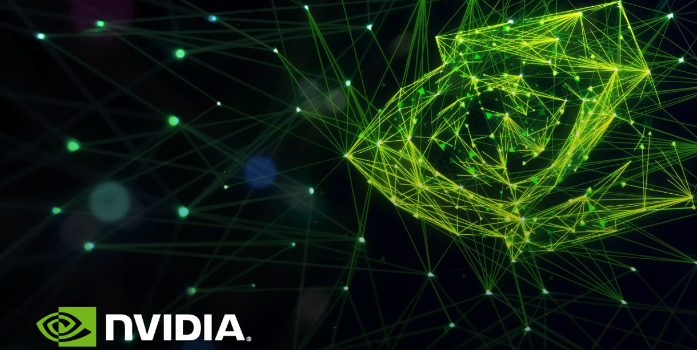

  

# Real Time The Finger Detection with Nvidia Jetson 

## Motivation
In Western culture, [the finger](https://www.wikiwand.com/en/The_finger) or the middle finger is an obscene hand gesture. It is performed by showing the back of a hand that has only the middle finger extended upwards, though in some locales, the thumb is extended.

The contents on the internet becoming much more accessible though there is not enough access restrictions when it comes to the kids. Simply, kids do what they see. It is not cool for your child to show 'the finger' after watching PewDiePie where the majority of the audience is children.

  

I have developed an object detection model that can detect the finger and censors it. The model can be found in <a href='model'>here</a>. This project uses:

<li>Nvidia Jetson Xavier Nx (any jetson would be fine)
<li>Raspberry Pi Camera Module V2 (any camera that jetson supports would be fine)
<li> [jetson-inference](https://github.com/dusty-nv/jetson-inference) library
<li> One middle finger
<!--   -->

  

<!-- This project uses NVIDIA [TensorRT](https://developer.nvidia.com/tensorrt) for detection -->